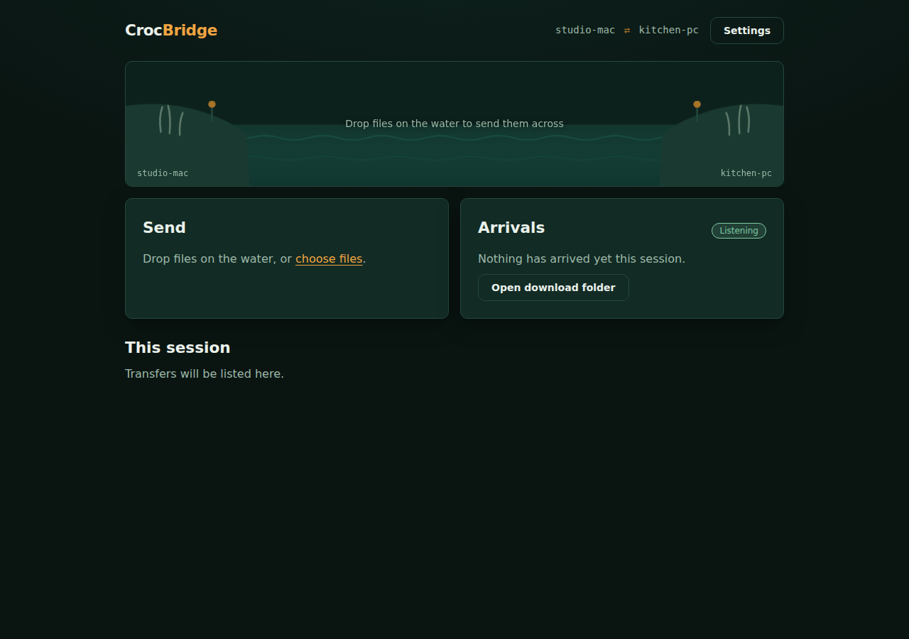
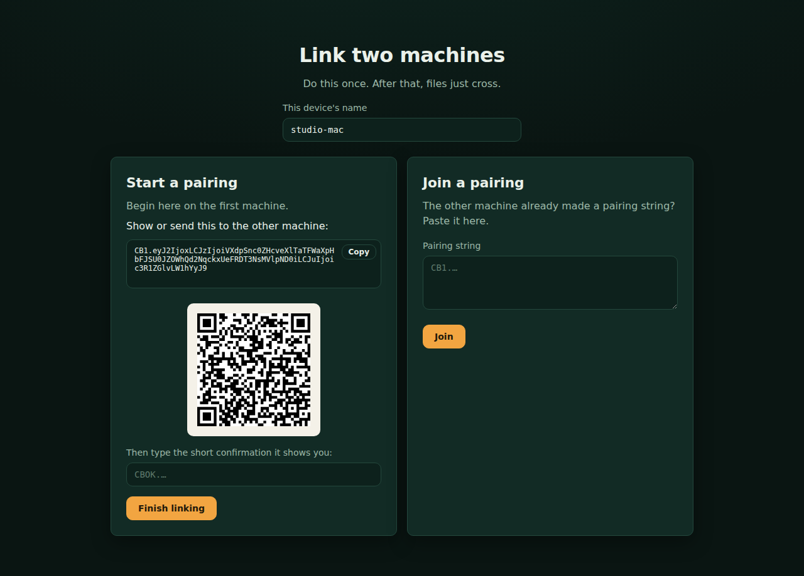

# CrocBridge

AirDrop-style file drops between two of your machines, powered by
[croc](https://github.com/schollz/croc). Pair once, then drag files onto the
water — they appear on the other side. You never see or type a transfer code.

Two banks, one river: your machines are the banks, and every transfer is a
little raft crossing between them.



## How it works

- Both machines run the same small Flask app locally (`127.0.0.1` only).
- Pairing exchanges a 32-byte shared secret once, via a pairing string or QR.
- After that, transfer codes are **derived**, never displayed:
  `"cb" + HMAC-SHA256(secret, utc_date + ":" + receiver_name)[:14]`.
  Codes are directional (each device listens on a code derived from its own
  name) and rotate daily.
- A background daemon keeps a croc receiver listening; sends shell out to
  `croc send`. The secret only ever reaches croc through the `CROC_SECRET`
  environment variable — never on a command line (CVE-2023-43621).

## Install

Requirements: Python 3.11+, croc **v9.6.5 or newer** on your PATH.

```sh
# 1. croc (skip if installed) — or run scripts/get-croc.sh
brew install croc                              # macOS
curl https://getcroc.schollz.com | bash        # Linux
winget install schollz.croc                    # Windows

# 2. the app
git clone <this repo> && cd crocbridge
pip install -r requirements.txt
python -m crocbridge
```

Open http://127.0.0.1:5599. Do the same on the second machine.

Flags: `--port` (default 5599), `--config` (default `~/.crocbridge/config.json`),
`--host` (default `127.0.0.1` — binding anywhere else is loudly discouraged:
the API has no authentication).

## Pairing walkthrough (under a minute)

1. **Machine A**: name the device, click **Create pairing**. A pairing string
   and QR appear.
   
2. **Machine B**: name the device, paste (or scan and paste) the pairing
   string, click **Join**. B is now linked and shows a short confirmation.
3. **Machine A**: type B's confirmation, click **Finish linking**. Done — both
   sides show the bridge.

The confirmation is authenticated: A only accepts a device name backed by the
shared secret, so a typo fails safely instead of pairing with the wrong name.

## Everyday use

- **Send**: drop files on the river scene (or *choose files*). The raft shows
  progress, speed, and time left; the Send panel lists each file.
- **Receive**: the Arrivals panel shows the listener state and everything that
  landed this session; *Open download folder* jumps to the files.
- **History**: every crossing this session, with direction, size, duration,
  and result.
- **Settings**: device name, download folder, custom relay + relay password,
  SOCKS5 proxy, overwrite toggle. *Unpair* (with confirmation) wipes the
  secret from this machine.

## Try it on one machine

Two instances with separate ports and configs behave like two devices:

```sh
python -m crocbridge --port 5599 --config /tmp/cb-a/config.json
python -m crocbridge --port 5601 --config /tmp/cb-b/config.json
```

Give them different download folders in Settings. `scripts/e2e.sh` automates
exactly this (plus a local relay) and asserts a full transfer end to end.

## Troubleshooting

| Symptom | Likely cause / fix |
|---|---|
| Setup screen: croc missing or too old | Install/update croc (commands above). v9.6.5+ is required for safe secret passing. |
| "Can't reach the relay." | Default is croc's public relay; some networks block it. Run `croc relay` on a reachable host and set its `host:port` in Settings on **both** machines. |
| "No one picked up on the other bank." | The peer's app isn't running, or its receiver is on a different relay. Open CrocBridge on the peer and match relay settings. |
| "Can't write to the download folder." | Pick a writable folder in Settings. |
| A send right around midnight UTC failed | Codes rotate daily; a transfer that straddles the rotation can miss. Just send again — the retry derives the fresh code. |
| First send after a long idle takes a beat | By design: the first attempt re-syncs sender/receiver ordering and retries instantly. |
| Renamed a device and transfers stopped | Both sides derive codes from the receiver's name. Re-pair after renaming, or rename back. |

Advanced: `throttle_upload` in `config.json` (e.g. `"500k"`, `"10M"`) caps
upload speed via croc's `--throttleUpload`. The relay password is passed via
the `CROC_PASS` environment variable, not argv.

## Development

```sh
pip install -r requirements.txt
python -m pytest            # unit tests: derivation, pairing, parsing, config
bash scripts/e2e.sh         # full two-instance transfer through a local relay
```

Backend is Flask + the Python standard library, no database; frontend is
vanilla JS/CSS served by Flask, no build step. The only vendored asset is
`qrcode-generator` (MIT) for the pairing QR.
